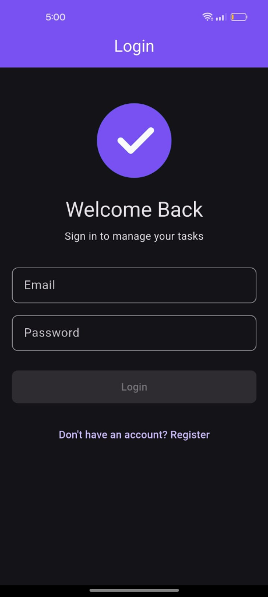
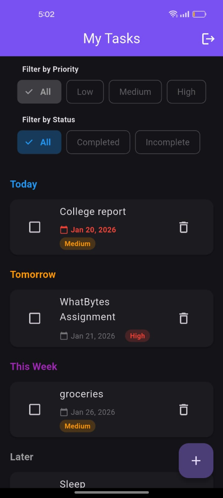

# Gig Task Manager

A Flutter task management application for gig workers built with clean architecture, BLoC state management, and Firebase backend.

## Screenshots

<p align="center">
  
  
</p>

## Features

- **User Authentication**: Email/password registration and login using Firebase Authentication
- **Task Management**: Create, edit, delete, and view tasks
- **Task Properties**: Each task includes:
  - Title (required)
  - Description
  - Due date
  - Priority (Low, Medium, High)
  - Completion status
- **Filtering**: Filter tasks by priority and completion status
- **Sorting**: Tasks are automatically sorted by due date (earliest first)
- **Clean UI**: Material Design 3 with responsive layout for iOS and Android

## Architecture

This app follows **Clean Architecture** principles with clear separation of concerns:

- **Domain Layer**: Entities, repositories (interfaces), and use cases
- **Data Layer**: Repository implementations, data sources, and models
- **Presentation Layer**: BLoC state management, UI screens, and widgets

### State Management

Uses **flutter_bloc** for state management:
- `AuthBloc`: Manages authentication state
- `AuthFormBloc`: Handles login/registration forms
- `TaskListBloc`: Manages task list, filtering, and sorting
- `TaskEditBloc`: Handles task creation and editing

## Setup

### Prerequisites

- Flutter SDK (latest stable version)
- Firebase project with Authentication and Firestore enabled
- Android Studio / Xcode for platform-specific setup

### Installation

1. Clone the repository
2. Install dependencies:
   ```bash
   flutter pub get
   ```

3. Configure Firebase:
   - Follow the instructions in [FIREBASE_SETUP.md](FIREBASE_SETUP.md)
   - Add `google-services.json` for Android
   - Add `GoogleService-Info.plist` for iOS

4. Run the app:
   ```bash
   flutter run
   ```

## Project Structure

```
lib/
├── core/
│   ├── constants/      # App-wide constants
│   ├── errors/         # Failure classes
│   ├── injection/      # Dependency injection setup
│   ├── theme/          # App theme configuration
│   ├── usecases/       # Base use case classes
│   └── utils/          # Utility functions
├── features/
│   ├── auth/
│   │   ├── data/       # Auth data layer (Firebase implementation)
│   │   ├── domain/      # Auth domain layer (entities, repositories, use cases)
│   │   └── presentation/ # Auth UI and BLoC
│   └── tasks/
│       ├── data/       # Tasks data layer (Firestore implementation)
│       ├── domain/      # Tasks domain layer (entities, repositories, use cases)
│       └── presentation/ # Tasks UI and BLoC
└── main.dart           # App entry point
```

## Dependencies

- `flutter_bloc`: State management
- `equatable`: Value equality
- `firebase_core`: Firebase initialization
- `firebase_auth`: Authentication
- `cloud_firestore`: Database
- `intl`: Date formatting
- `get_it`: Dependency injection
- `dartz`: Functional programming (Either type for error handling)

## Usage

1. **Register/Login**: Create an account or sign in with email and password
2. **Create Tasks**: Tap the + button to create a new task
3. **Edit Tasks**: Tap on a task to edit its details
4. **Complete Tasks**: Check the checkbox to mark a task as complete
5. **Filter Tasks**: Use the filter chips to filter by priority or status
6. **Delete Tasks**: Tap the delete icon on a task item or in the edit screen

## Firestore Structure

Tasks are stored in Firestore with the following structure:

```
users/
  {userId}/
    tasks/
      {taskId}/
        title: string
        description: string
        dueDate: timestamp
        priority: string ("low", "medium", "high")
        isCompleted: boolean
        createdAt: timestamp
        updatedAt: timestamp
```

## Development Notes

- The app uses clean architecture to ensure testability and maintainability
- All business logic is in the domain layer, independent of frameworks
- BLoC pattern provides reactive state management
- Error handling uses Either type from dartz package
- Firebase provides backend services (auth and database)

## License

This project is created for evaluation purposes.
